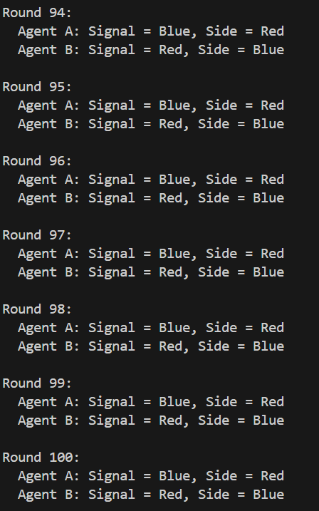
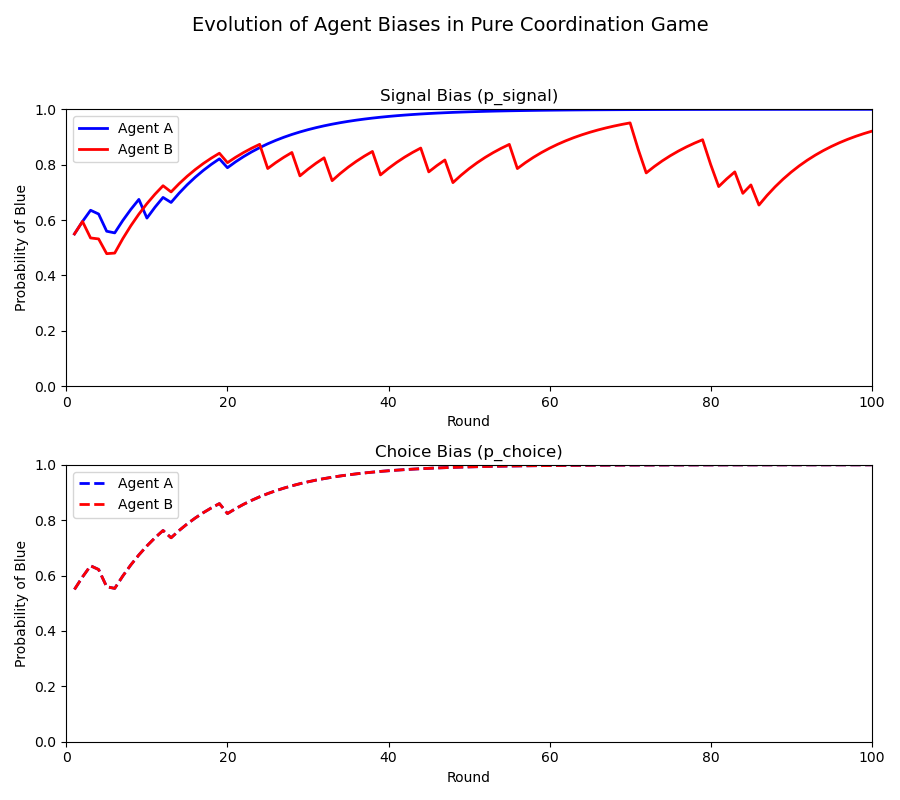

# My Thoughts and Questions on Agent Decision-Making

## Thoughts

1. **Influence of Agent Historical State on Decisions**  
     
   How does accumulated past experience or recorded interactions affect the choices made by the agent?

2. **Decisions Should Be Related to the Environment or Rewards**  
     
   How can we effectively integrate these external factors into the agent's learning and decision process?

3. **Scalability Issues with Many Agents**  
   As the number of agents increases, there is a concern that the current rules for environment or reward may become less effective, potentially leading to very slow convergence of the system. What strategies can be used to address or mitigate these scalability issues?

## Questions

- **Where Does the Player's Attention Lie?**  
  - Is the player's attention primarily drawn to the reward outcomes, the interactions among agents, or the agent’s own internal state?  
  - Could the decision-making process be influenced by the network structure of the players? For example, does the connectivity or social network of the players affect how they perceive rewards or interactions, and thereby influence their decisions?
